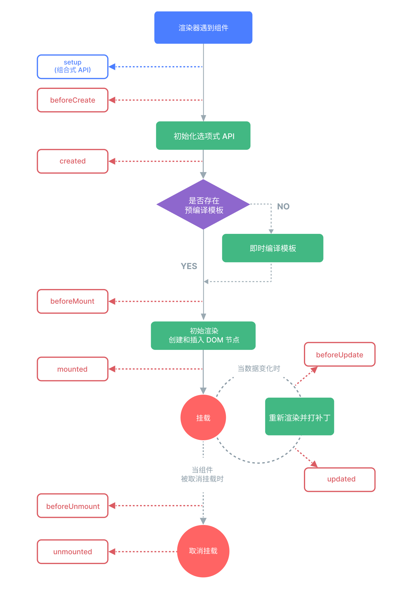
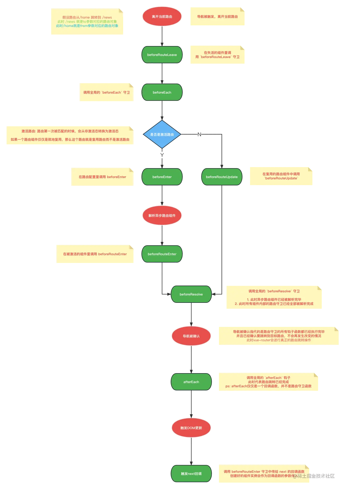

# 关于前端框架的学习

主要看vue2，vue3

## vue2

## vue3

### vue单文件组件（SFC）

- `<script setup>`

每个 *.vue 文件最多可以包含一个 `<script setup>`。(不包括一般的 `<script>`)
当使用 `<script setup>` 的时候，任何在 `<script setup>` 声明的顶层的绑定 (包括变量，函数声明，以及 import 导入的内容) 都能在模板中直接使用：

```vue
<script setup>
// 变量
const msg = 'Hello!'

// 函数
function log() {
  console.log(msg)
}
</script>

<template>
  <button @click="log">{{ msg }}</button>
</template>
```

### 内置的特殊 Attributes

- key

key 这个特殊的 attribute 主要作为 Vue 的虚拟 DOM 算法提示，在比较新旧节点列表时用于识别 vnode。
在没有 key 的情况下，Vue 将使用一种最小化元素移动的算法（就地更新，尽量不移动元素），并尽可能地就地更新/复用相同类型的元素。如果传了 key，则将根据 key 的变化顺序来重新排列元素，并且将始终移除/销毁 key 已经不存在的元素。

- ref

用于注册模板引用。

- is

用于绑定动态组件。

### 生命周期选项



### 内置组件

- KeepLive

只能有一个子组件

有一个include prop 可以设置为字符串`include="a,b"`或者正则`:include="/^(a|b)$/"`或者数组`:include="['a','b']"`
还有 exclude，max prop

我以为的实现原理：组件内部调用默认slot函数，并缓存其结果，以结果的vnode的name来作为缓存key。当再次调用默认slot函数时，其内部的根据组件创建实例的方法会直接找当前组件的缓存，如果有直接从里面拿到结果。

[Vue源码解析，keep-alive是如何实现缓存的？](https://juejin.cn/post/6862206197877964807)

### vue-router 守卫



## vue2和3有什么不同

## vite

## ract
