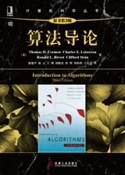

# algorithm-study
关于算法图解和算法导论和对算法的学习

## 算法
- 算法（Algorithm）是指解题方案的准确而完整的描述，是一系列解决问题的清晰指令，算法代表着用系统的方法描述解决问题的策略机制。也就是说，能够对一定规范的输入，在有限时间内获得所要求的输出。如果一个算法有缺陷，或不适合于某个问题，执行这个算法将不会解决这个问题。不同的算法可能用不同的时间，空间或效率来完成同样的任务。一个算法的优劣可以用空间复杂度与时间复杂度来衡量。