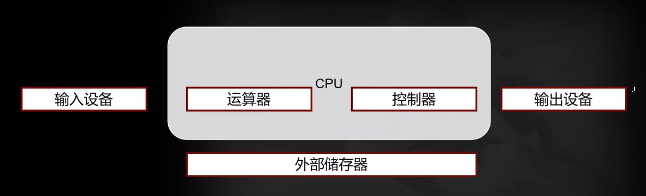

#### 冯诺依曼架构

1、定义

冯·诺依曼提出了电子计算机系统制造的三个基本原则，即采用二进制逻辑、程序存储执行以及电子计算机系统由五个部分组成（运算器、控制器、存储器、输入设备、输出设备，其中运算器与控制器又共同组成为中央处理器CPU），这套理论被称为冯·诺依曼体系结构。

第一个原则采用二进制逻辑比较容易理解，即是使用01二进制串来编码表达程序的数据以及指令进行运算

第二个原则程序存储执行是通过内部存储器（内存）保存运算程序（指令和数据），cpu与存储器进行交互来执行程序。

第三个原则概括了电子计算机系统的必须构成，缺一不可。

2、特点

现代电子计算机发展所遵循的基本结构形式始终是冯·诺依曼机结构。这种结构特点是“程序存储，共享数据，顺序执行”，需要 CPU 从存储器取出指令和数据进行相应的计算，计算后又把结果写回存储器。

主要特点有：

（1）单处理机结构，机器以运算器为中心；

（2）采用程序存储思想；

（3）指令和数据一样可以参与运算；

（4） 数据以二进制表示；

（5）将软件和硬件完全分离；

（6） 指令由操作码和操作数组成；

（7）指令顺序执行。

（8）多个处理器共享存储器以及程序的指令和数据也共享存储器

3、局限

CPU 与共享存储器间的信息交换的速度成为影响系统性能的主要因素，而信息交换速度的提高又受制于存储元件的速度、存储器的性能和结构等诸多条件。

对冯·诺依曼计算机体系结构缺陷的分析：

（1）指令和数据存储在同一个存储器中，形成系统对存储器的过分依赖。如果储存器件的发展受阻，系统的发展也将受阻。

（2）指令在存储器中按其执行顺序存放，由指令计数器PC指明要执行的指令所在的单元地址。 然后取出指令执行操作任务，所以指令的执行是串行，影响了系统执行的速度。

（3）存储器是按地址访问的线性编址，按顺序排列的地址访问，利 于存储和执行的机器语言指令，适用于作数值计算。但是高级语言表示的存储器则是一组有名字的变量，按名字调用变量，不按地址访问。机器语言同高级语言在语义上存在很大的间隔。

（4）冯·诺依曼体系结构计算机是为算术和逻辑运算而诞生的，在数值处理方面很优秀，但非数值处理应用领域发展缓慢，需要在体系结构方面有重大的突破。

（5）传统的冯·诺依曼型结构属于控制驱动方式。它是执行指令代码对数值代码进行处理，只要指令明确，输入数据准确，启动程序后自动运行而且结果是预期的。一旦指令和数据有错误，机器不会主动修改指令并完善程序。现代计算机的智能是无法应对不能预期的复杂的任务。