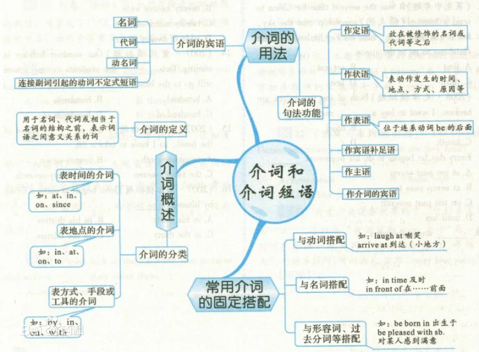

#### 1.名词

名词（英语：noun，缩写n.），是词类的一种，属于实词。它表示人、事、物、地点或抽象概念的统一名称。它分为专有名词和普通名词。
在英语中，名词的格有3种：主格、宾格、所有格。其中个体名词表示某类人或东西中的个体，如girl（女孩）等；集体名词表示若干个个体组成的集合体，如audience（观众，听众）等；物质名词表示无法分为个体的实物，如water水等;抽象名词表示动作、状态、品质、感情等抽象概念，如work（工作），happiness幸福等。对于普通名词来说，可分为可数名词和不可数名词。

#### 2.代词

代词（英文pronoun，简称pron.），是指代名词或一句话的一种词类。大多数代词具有名词和形容词的功能。英语中的代词，按其意义、特征及在句中的作用分为：人称代词、物主代词、指示代词、反身代词、相互代词、疑问代词、关系代词、连接代词、不定代词和替代词十种。

#### 3.动词

动词（verb），汉语词语，意思是用来表示人或事物的动作或状态的词语。
注意还能表示状态，不止是表示动作，还有是人或事而不是单单是人

be动词用法口诀：
我(I)用 am，你(you)用 are，is 连着他(he)、她(she)、它(it)

单数名词用 is，复数名词都用 are

#### 4.副词

副词（Adverb 简称adv.）是指在句子中表示行为或状态特征的词，用以修饰动词、形容词、其他副词或全句，表示时间、地点、程度、方式等概念。副词可分为：时间副词、频率副词、地点副词、方式副词、程度副词、疑问副词、连接副词、关系副词、表顺序的副词以及表完成的副词。

#### 5.形容词

形容词(英文 :adjective，简称adj. )是词类的一种，主要用来描写或修饰名词或代词，表示人或事物的性质、 状态、特征或属性，常用作定语，也可作表语或补语。

#### 6.数词

数词（Numeral），简称（num）,是指表示数目多少或顺序多少的词。英语的数词可以作句子的主语、宾语、表语和定语。数词分为两大类，即基数词和序数词。基数词表示数目，如：one,two,three,four……；序数词表示顺序，如：first,second,third,fourth……序数词前一般要加the。

#### 7.冠词

冠词（Article）是一种虚词，并非只存在于英语中，而是普遍存在于印欧语系和闪含语系中。冠词在句子中一般不重读，本身不能独立使用，只能与名词放在一起（一般用于名词之前 ）帮助说明名词所指的人或事物。
冠词的类型包括不定冠词（Indefinite Article）、定冠词（Definite Article）、否定冠词（Negative Article）、部分冠词（Partitive Article）和零冠词（Zero Article，即不用冠词）。
在英语中，它是词性中最小的一类，简称“art.”，只有三种类型：不定冠词、 定冠词和零冠词。汉语中没有冠词。

#### 8.介词

英语前置词（preposition，adposition的一种，还有后置词postposition），表示名词、代词等与句中其它词的关系，在句中不能单独作句子成分。介词后面一般有名词、代词或相当于名词的其他词类、短语或从句作它的宾语，表示与其他成分的关系。
前置词和它的宾语构成介词词组，在句中作状语，表语，补语，定语或介词宾语。同时介词的用法也很灵活，同一个介词可以表达多种意义，介词可以分为时间介词、地点介词、方式介词、原因介词、数量介词和其他介词。
前置词一般用于名词或者代词前面，表示该词与句中其他成分的关系。前置词后面的名词或代词称为前置词的宾语（如果是人称代词，则要用宾格）。前置和宾语合在一起构成前置词短语。

#### 9.连词

连词（conjunction）是一种虚词， 它不能独立担任句子成分而只起连接词与词，短语与短语以及句与句的作用。
连词主要可分为4类：并列连词、转折连词、选择连词和因果连词。
连词也可以分为2类：并列连词和从属连词。

#### 10.感叹词

表示说话时喜悦、惊讶等情感的词就是感叹词。感叹词有oh，喔，耶，啊，哇等。感叹词一般放在句首，后用逗号隔开，感情强烈时，可用感叹号表示。

