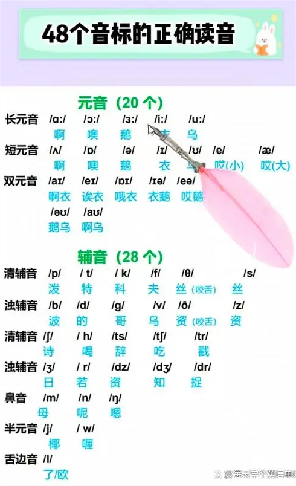

48 个音标的正确发音



```js
{
    元音: {
        单元音: {
            前元音: ['i:','i','e','æ'],      // 衣，衣，哎（小），哎（大）
            中元音: ['ʌ','ə:','ə'],      // 啊，鹅，鹅
            后元音: ['u:','u','ɔ:','ɔ','a:'],      // 乌，乌，噢，噢，啊
        },
        双元音: {
            开合双元音: ['ei','ai','ɔi','əu','au'],      // 哎衣，啊衣，噢衣，鹅乌，啊乌
            集中双元音: ['iə','εə','uə'],      // 衣鹅，唉鹅，乌鹅
        },
    }
    辅音: {
        爆破音: {
            清辅音: ['p','t','k'],      // 泼，特，科
            浊辅音: ['b','d','g'],      // 波，的，哥
        },
        摩擦音: {
            清辅音: ['f','s','ʃ','θ','h'],      // 夫，丝，诗，丝（咬舌），喝
            浊辅音: ['v','z','ʒ','ð',],      // 乌，资，日，资（咬舌）
        },
        破擦音: {
            清辅音: ['tʃ','tr','ts'],      // 七，出，词
            浊辅音: ['dʒ','dr','dz'],      // 及，祝，兹
        },
        鼻音: {
            浊辅音: ['m','n','ŋ'],      // 母，呢，嗯
        },
        舌则音: {
            浊辅音: ['l','r'],      // 了/欧，若
        },
        半元音: {
            浊辅音: ['w','j'],      // 喔，椰
        },
    },
}
```
