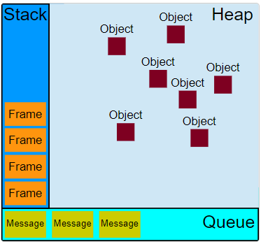

## 并发模型与事件循环

JavaScript 有一个基于事件循环的并发模型，事件循环负责执行代码、收集和处理事件以及执行队列中的子任务。这个模型与其他语言中的模型截然不同，比如 C 和 Java。

#### 运行时概念



#### 栈 (调用栈，又叫执行栈)
函数调用形成了一个由若干帧组成的栈。

在 JavaScript 中，调用栈（Call Stack）和执行栈（Execution Stack）通常指的是同一个概念，即用来跟踪函数调用的栈结构。这个栈结构用于存储函数调用的顺序，以便知道接下来应该执行哪个函数。不过，如果我们严格区分这两个术语，它们的含义可能如下：

1. **调用栈（Call Stack）**：
   - 调用栈是一个数据结构，它记录了所有函数调用的顺序。
   - 当一个函数被调用时，这个函数的执行上下文（包括变量、参数、this 值等）被推入调用栈。
   - 当函数执行完毕，其执行上下文从调用栈中弹出，控制权返回给上一个函数。
   - 调用栈也用于处理函数的递归调用和嵌套调用。

2. **执行栈（Execution Stack）**：
   - 这个术语不是 JavaScript 规范中的正式术语，但它有时被用来指代当前正在执行的代码块或函数的上下文。
   - 在某些文献中，执行栈可能被用来描述当前正在执行的函数的上下文，包括局部变量、参数等。
   - 理解 JavaScript 中的执行上下文和执行栈 https://blog.bitsrc.io/understanding-execution-context-and-execution-stack-in-javascript-1c9ea8642dd0

在实际使用中，这两个术语通常是可以互换的，因为它们描述的是同一个概念：一个用于跟踪函数调用顺序的栈结构。这个栈确保了 JavaScript 引擎能够按照正确的顺序执行代码，并且在函数调用结束后能够返回到正确的位置继续执行。

以下是调用栈的一些关键点：

- 当 JavaScript 代码开始执行时，它首先进入全局执行上下文，这是调用栈的起点。
- 每当一个函数被调用，一个新的执行上下文就会被创建并推入调用栈。
- 调用栈是后进先出（LIFO）的数据结构，这意味着最后一个被推入栈的函数会第一个被执行，并且当它执行完毕后，它会从栈中弹出，控制权返回给上一个函数。
- 如果调用栈中的函数调用超过了 JavaScript 引擎的最大调用栈大小，就会发生“最大调用栈大小超过”错误（通常称为“stack overflow”）。

总的来说，调用栈是 JavaScript 运行时环境用来跟踪函数调用和执行顺序的核心机制。

#### 堆
对象被分配在堆中，堆是一个用来表示一大块（通常是非结构化的）内存区域的计算机术语。

#### 队列
一个 JavaScript 运行时包含了一个待处理消息的消息队列。每一个消息都关联着一个用以处理这个消息的回调函数。

在 事件循环 期间的某个时刻，运行时会从最先进入队列的消息开始处理队列中的消息。被处理的消息会被移出队列，并作为输入参数来调用与之关联的函数。正如前面所提到的，调用一个函数总是会为其创造一个新的栈帧。

函数的处理会一直进行到执行栈再次为空为止；然后事件循环将会处理队列中的下一个消息（如果还有的话）。

任务队列可以分为宏任务（Macro Tasks）和微任务（Micro Tasks）。微任务通常包括 Promise 回调、MutationObserver 等，它们会在当前执行栈清空后、下一次宏任务开始前执行。
js提供一个主动入列微任务的全局方法 `queueMicrotask(() => {/* ... */});`。
宏任务包括 setTimeout、setInterval、I/O、UI 渲染等，它们在当前执行栈清空后、所有微任务执行完毕后执行。

#### 事件循环
之所以称之为 事件循环，是因为它经常按照类似如下的方式来被实现：
```js
while (queue.waitForMessage()) {
  queue.processNextMessage();
}
```
queue.waitForMessage() 会同步地等待消息到达 (如果当前没有任何消息等待被处理)。

#### "执行至完成"
每一个消息完整地执行后，其他消息才会被执行。这为程序的分析提供了一些优秀的特性，包括：当一个函数执行时，它不会被抢占，只有在它运行完毕之后才会去运行任何其他的代码，才能修改这个函数操作的数据。这与 C 语言不同，例如，如果函数在线程中运行，它可能在任何位置被终止，然后在另一个线程中运行其他代码。

这个模型的一个缺点在于当一个消息需要太长时间才能处理完毕时，Web 应用程序就无法处理与用户的交互，例如点击或滚动。为了缓解这个问题，浏览器一般会弹出一个“这个脚本运行时间过长”的对话框。一个良好的习惯是缩短单个消息处理时间，并在可能的情况下将一个消息裁剪成多个消息。

#### 添加消息
在浏览器里，每当一个事件发生并且有一个事件监听器绑定在该事件上时，一个消息就会被添加进消息队列。如果没有事件监听器，这个事件将会丢失。所以当一个带有点击事件处理器的元素被点击时，就会像其他事件一样产生一个类似的消息。

#### 永不阻塞
JavaScript 的事件循环模型与许多其他语言不同的一个非常有趣的特性是，它永不阻塞。处理 I/O 通常通过事件和回调来执行，所以当一个应用正等待一个 IndexedDB 查询返回或者一个 XHR 请求返回时，它仍然可以处理其他事情，比如用户输入。

由于历史原因有一些例外，如 alert 或者同步 XHR，但应该尽量避免使用它们。注意，例外的例外也是存在的（但通常是实现错误而非其他原因）。