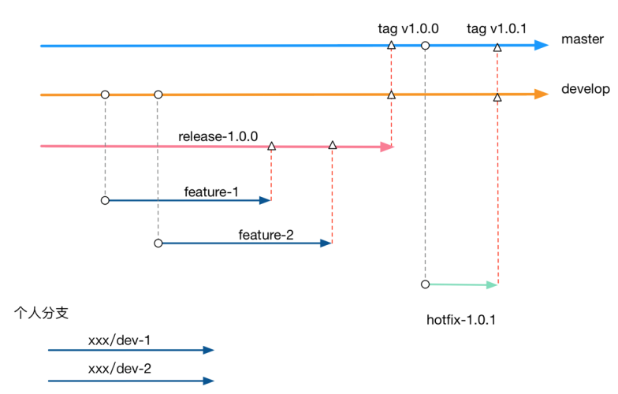

## branch 规范



#### master 分支

不能往master 分支上提交代码，只能在该分支上进行代码合并操作，例如将其它分支的代码合并到 Master 分支上。

#### develop 分支

我们日常开发中的代码需要从 master 分支拉一条 develop 分支出来，该分支所有人都能访问，但一般情况下，我们也不会直接在该分支上提交代码，代码同样是从其它分支合并到 develop 分支上去。

#### feature 分支

当我们需要开发某个特性时，需要从 develop 分支拉出一条 feature 分支，例如 feature/update_mq 与 feature/update_netty，在这些分支上并行地开发具体特性。

#### release 分支

当特性开发完毕后，我们决定需要发布某个版本了，此时需要从 develop 分支上拉出一条 release 分支，例如 release-1.0.0，并将需要发布的特性从相关 feature 分支一同合并到 release 分支上，随后将针对 release 分支推送到测试环境，测试工程师在该分支上做功能测试，开发工程师在该分支上修改 bug。待测试工程师无法找到任何 bug 时，我们可将该 release 分支部署到预发环境，再次验证以后，均无任何 bug，此时可将 release 分支部署到生产环境。

#### tag

待上线完成后，将 release 分支上的代码同时合并到 develop 分支与 master 分支，并在 master 分支上打一个 tag，例如 v1.0.0。

#### hotfix

当生产环境发现 bug 时，我们需要从对应的 tag 上（例如 v1.0.0）拉出一条 hotfix 分支（例如 hotfix-1.0.1），并在该分支上做 bug 修复。待 bug 完全修复后，需将 hotfix 分支上的代码同时合并到 develop 分支与 master 分支。同时在master上打上tag，v1.0.1。

#### 版本号

对于版本号我们也有要求，格式为：x.y.z，其中，x 用于有重大重构时才会升级，y 用于有新的特性发布时才会升级，z 用于修改了某个 bug 后才会升级。

#### 个人分支

个人分支下可以建目录，例如: xiaoguai/dev1, xiaoguai/dev2

## Commit Message规范

采用 <a href="https://github.com/angular/angular/blob/main/CONTRIBUTING.md#commit">Angular的commit message规范</a>

Each commit message consists of a header, a body, and a footer.

```
<header>
<BLANK LINE>
<body>
<BLANK LINE>
<footer>
```

其中 header是必填的，body和footer是选填的。

Commit Message Header

```
<type>(<scope>): <short summary>
  │       │             │
  │       │             └─⫸ Summary in present tense. Not capitalized. No period at the end.
  │       │
  │       └─⫸ Commit Scope: animations|bazel|benchpress|common|compiler|compiler-cli|core|
  │                          elements|forms|http|language-service|localize|platform-browser|
  │                          platform-browser-dynamic|platform-server|router|service-worker|
  │                          upgrade|zone.js|packaging|changelog|docs-infra|migrations|
  │                          devtools
  │
  └─⫸ Commit Type: build|ci|docs|feat|fix|perf|refactor|test
```
##### Type

  Must be one of the following:

  - build: Changes that affect the build system or external dependencies (example scopes: gulp, broccoli, npm)
  - ci: Changes to our CI configuration files and scripts (examples: CircleCi, SauceLabs)
  - docs: Documentation only changes
  - feat: A new feature
  - fix: A bug fix
  - perf: A code change that improves performance
  - refactor: A code change that neither fixes a bug nor adds a feature
  - test: Adding missing tests or correcting existing tests

## 常用命令

git相关配置

```sh
# 安装完Git后第一件要做的事，设置用户信息(global可换成local在单独项目生效)：
git config --global user.name "用户名" # 设置用户名
git config --global user.email "用户邮箱"   #设置邮箱
git config --global user.name   # 查看用户名是否配置成功
git config --global user.email   # 查看邮箱是否配置

# 其他查看配置相关
git config --global --list  # 查看全局设置相关参数列表
git config --local --list # 查看本地设置相关参数列表
git config --system --list # 查看系统配置参数列表
git config --list  # 查看所有Git的配置(全局+本地+系统)
git config --global color.ui true //显示git相关颜色
```

#### 比较文件异同

```sh
git diff # 工作区与暂存区的差异
git diff 分支名 #工作区与某分支的差异，远程分支这样写：remotes/origin/分支名
git diff HEAD  # 工作区与HEAD指针指向的内容差异
git diff 提交id 文件路径 # 工作区某文件当前版本与历史版本的差异
git diff --stage # 工作区文件与上次提交的差异
git diff 版本TAG # 查看从某个版本后都改动内容
git diff 分支A 分支B # 比较从分支A和分支B的差异(也支持比较两个TAG)
git diff 分支A...分支B # 比较两分支在分开后各自的改动
```

#### 创建分支

```sh
git checkout -b dev
-b表示创建并切换分支
上面一条命令相当于一面的二条：
git branch dev # 创建分支
git checkout dev # 切换分支
```

#### 查看历史记录

```sh
git log # 查看所有commit记录(SHA-A校验和，作者名称，邮箱，提交时间，提交说明)
git log -p -次数 # 查看最近多少次的提交记录
git log fileName # 查看某文件的修改记录，找背锅专用
```

#### 合并分支

```sh
git merge dev # 用于合并指定分支到当前分支
git merge --no-ff -m "merge with no-ff" dev
# 加上--no-ff参数就可以用普通模式合并，合并后的历史有分支，能看出来曾经做过合并

尽量使用rebase代替merge，好处主要有两个：
1）rebase操作可以把本地未push的分叉提交历史整理成直线；
2）rebase的目的是使得我们在查看历史提交的变化时更容易，因为分叉的提交需要三方对比。
```

#### 删除分支

```sh
git branch -d dev
```

#### 查看分支合并图

```sh
git log --graph --pretty=oneline --abbrev-commit
```

#### 标签命令

```sh
git tag 标签 # 打标签命令，默认为HEAD
git tag # 显示所有标签
git tag 标签 版本号 # 给某个commit版本添加标签
git show 标签 # 显示某个标签的详细信息
```