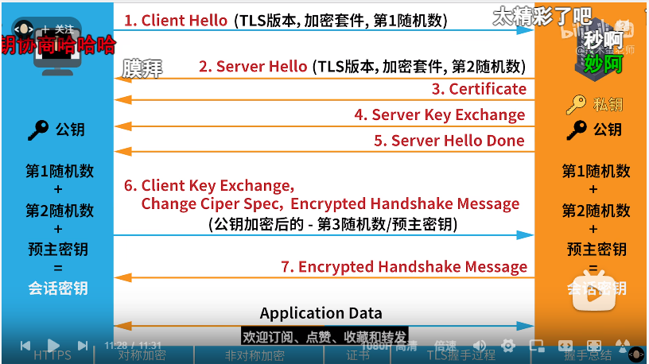

#### SSL/TLS

- 传输层安全性协议（英语：Transport Layer Security，缩写作 TLS），及其前身安全套接层（Secure Sockets Layer，缩写作 SSL）是一种安全协议，目的是为互联网通信，提供安全及数据完整性保障。
- 网景公司（Netscape）在 1994 年推出首版网页浏览器，网景导航者时，推出 HTTPS 协议，以 SSL 进行加密，这是 SSL 的起源。
  IETF 将 SSL 进行标准化，1999 年公布第一版 TLS 标准文件。随后又公布 RFC 5246 （2008 年 8 月）与 RFC 6176 （2011 年 3 月）。
- 在浏览器、电子邮件、即时通信、VoIP、网络传真等应用程序中，广泛支持这个协议。

#### HTTPS

- http + SSl/TLS 的简写，主要是对 http 的传输内容进行加密，防止数据被截取和篡改。
- 发展过程描述

  - a 向 b 发送请求，如果使用 http 的话则是明文传输，很容易被 c 拦截并篡改。
  - 所以 a 和 b 商量了下一起用对称加密来对内容进行加密，这样 c 就读不懂并改不了了，但是这个对称加密的密钥怎么发给对方呢，如果和内容一起发给对方不就露馅了吗。
  - 于是双方商量用非对称加密，a 先给 b 发个空请求，然后 b 回应一个公钥，a 再用公钥加密数据发给 b，b 用私钥解密就能读取到内容了。但是这样要是有漏洞，c 万一拦截了 b 的响应并换成了他自己的公钥咋整呢，此时 a 用 c 的公钥加密数据，c 用自己的私钥解密数据读取并篡改然后用 b 的公钥加密数据发送给 b，这样不就完美的拦截并篡改了吗。
  - 然后 a 和 b 又商量了下，找了个可靠的第三人 d，由 d 来判断 b 响应的公钥是不是 b 自己的，这样就能保证这个公钥是 b 的公钥，就能避免中间人攻击了。但是又有问题出现了，非对称加密太消耗性能了，而且数据量大了非常的慢。
  - 于是 a 和 b 又想起了对称加密，和非对称加密结合起来用，用非对称加密传对称加密的密钥，然后用对称加密处理数据，这样就完美了撒。

  具体过程 

现在的 tls 已经不一样的，现在变得非常复杂了，因为密钥如果是静态的话就会导致向前不安全问题，就是如果私钥被泄露了的话之前的请求就全部被泄露了。
