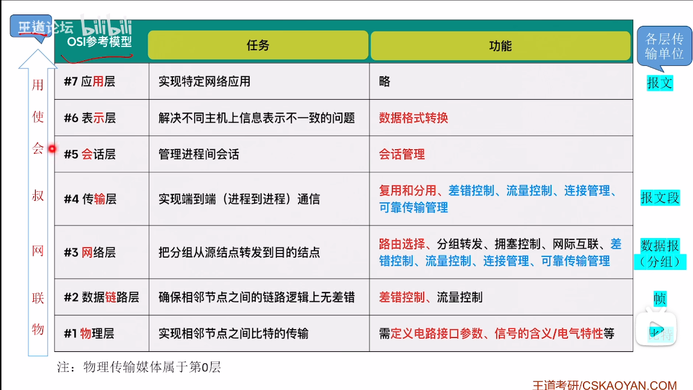
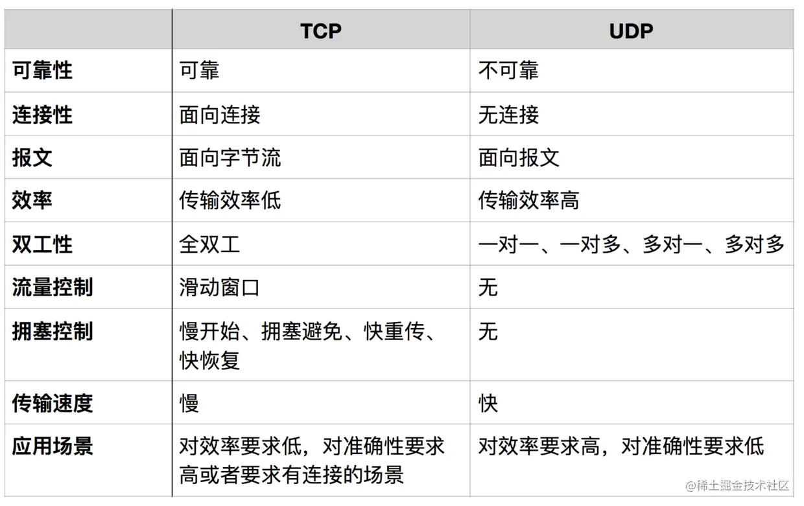

# OSI 的 7 层模型

- 应用层 http
- 表示层
- 会话层
- 传输层 tcp/ip
- 网络层
- 数据链路层
- 物理层

各个层级的功能如图所示

## TCP/IP 的 4 层模型

- 应用层 http
- 传输层 tcp/ip
- 网络层
- 网络接口层

## 常用的5层模型

- 应用层
- 传输层
- 网络层
- 数据接口层
- 物理层

IP 协议是 TCP/IP 协议的核心，所有的 TCP，UDP，IMCP，IGCP 的数据都以 IP 数据格式传输。

## IP 地址

在数据链路层中我们一般通过 MAC 地址来识别不同的节点，而在 IP 层我们也要有一个类似的地址标识，这就是 IP 地址。
32 位 IP 地址分为网络位和地址位，这样做可以减少路由器中路由表记录的数目，有了网络地址，就可以限定拥有相同网络地址的终端都在同一个范围内，那么路由表只需要维护一条这个网络地址的方向，就可以找到相应的这些终端了。

- A 类 IP 地址: 0.0.0.0~127.0.0.0
- B 类 IP 地址: 128.0.0.1~191.255.0.0
- C 类 IP 地址: 192.168.0.0~239.255.255.0

## ping 命令

ping 这个单词源自声纳定位，而这个程序的作用也确实如此，它利用 ICMP 协议包来侦测另一个主机是否可达。原理是用类型码为 0 的 ICMP 发请 求，受到请求的主机则用类型码为 8 的 ICMP 回应。
ping 程序来计算间隔时间，并计算有多少个包被送达。用户就可以判断网络大致的情况。我们可以看到， ping 给出来了传送的时间和 TTL 的数据。

## tracert 命令

Traceroute 是用来侦测主机到目的主机之间所经路由情况的重要工具，也是最便利的工具。

## TCP/UDP

TCP/UDP 都是是传输层协议，但是两者具有不同的特性，同时也具有不同的应用场景，下面以图表的形式对比分析。

TCP 协议是一种面向连接的、可靠的、基于字节流的运输层通信协议

- 面向报文
  - 面向报文的传输方式是应用层交给 UDP 多长的报文，UDP 就照样发送，即一次发送一个报文。因此，应用程序必须选择合适大小的报文。若报文太长，则 IP 层需要分片，降低效率。若太短，会是 IP 太小。
- 面向字节流

  - 面向字节流的话，虽然应用程序和 TCP 的交互是一次一个数据块（大小不等），但 TCP 把应用程序看成是一连串的无结构的字节流。TCP 有一个缓冲，当应用程序传送的数据块太长，TCP 就可以把它划分短一些再传送。
    关于拥塞控制，流量控制，是 TCP 的重点，后面讲解。
    TCP 和 UDP 协议的一些应用

- 所以说浏览器传文件能给个进度，因为当 tcp 发送的数据过大时会把数据拆分成很多小块，这样就能看到进度了。

## TCP 连接的建立与终止

a 为主动方，b 为被动方

- 三次握手
  其实就是让双方都确认下，防止某个过程被滞留了后面还成功建立连接的问题
  1. a->b 请求建立连接
  2. b->a 我可以和你建立连接，你确定要建立连接？
  3. a->b 我确定建立连接
  4. 然后连接就建立了
- 四次挥手
  也是让双方都确认下
  1. a->b 我没有数据要发送了，请求关闭连接
  2. b->a 我同意你关闭请求
  3. b->a 我没有数据要传了，我请求关闭连接
  4. a->b 我同意你关闭连接，然后等一会儿没收到 b 的消息表示 b 已经关了，然后我也关了。
  5. 然后连接就关闭了

1、三次握手
TCP 是面向连接的，无论哪一方向另一方发送数据之前，都必须先在双方之间建立一条连接。在 TCP/IP 协议中，TCP 协议提供可靠的连接服务，连接是通过三次握手进行初始化的。三次握手的目的是同步连接双方的序列号和确认号并交换 TCP 窗口大小信息。

第一次握手：建立连接。客户端发送连接请求报文段，将 SYN 位置为 1，Sequence Number 为 x；然后，客户端进入 SYN_SEND 状态，等待服务器的确认；
第二次握手：服务器收到 SYN 报文段。服务器收到客户端的 SYN 报文段，需要对这个 SYN 报文段进行确认，设置 Acknowledgment Number 为 x+1(Sequence Number+1)；同时，自己自己还要发送 SYN 请求信息，将 SYN 位置为 1，Sequence Number 为 y；服务器端将上述所有信息放到一个报文段（即 SYN+ACK 报文段）中，一并发送给客户端，此时服务器进入 SYN_RECV 状态；
第三次握手：客户端收到服务器的 SYN+ACK 报文段。然后将 Acknowledgment Number 设置为 y+1，向服务器发送 ACK 报文段，这个报文段发送完毕以后，客户端和服务器端都进入 ESTABLISHED 状态，完成 TCP 三次握手。
为什么要三次握手？

为了防止已失效的连接请求报文段突然又传送到了服务端，因而产生错误。
具体例子：“已失效的连接请求报文段”的产生在这样一种情况下：client 发出的第一个连接请求报文段并没有丢失，而是在某个网络结点长时间的滞留了，以致延误到连接释放以后的某个时间才到达 server。本来这是一个早已失效的报文段。但 server 收到此失效的连接请求报文段后，就误认为是 client 再次发出的一个新的连接请求。
于是就向 client 发出确认报文段，同意建立连接。假设不采用“三次握手”，那么只要 server 发出确认，新的连接就建立了。由于现在 client 并没有发出建立连接的请求，因此不会理睬 server 的确认，也不会向 server 发送数据。但 server 却以为新的运输连接已经建立，并一直等待 client 发来数据。这样，server 的很多资源就白白浪费掉了。采用“三次握手”的办法可以防止上述现象发生。例如刚才那种情况，client 不会向 server 的确认发出确认。server 由于收不到确认，就知道 client 并没有要求建立连接。”

2、四次挥手
当客户端和服务器通过三次握手建立了 TCP 连接以后，当数据传送完毕，肯定是要断开 TCP 连接的啊。那对于 TCP 的断开连接，这里就有了神秘的“四次分手”。

第一次分手：主机 1（可以使客户端，也可以是服务器端），设置 Sequence Number，向主机 2 发送一个 FIN 报文段；此时，主机 1 进入 FIN_WAIT_1 状态；这表示主机 1 没有数据要发送给主机 2 了；

第二次分手：主机 2 收到了主机 1 发送的 FIN 报文段，向主机 1 回一个 ACK 报文段，Acknowledgment Number 为 Sequence Number 加 1；主机 1 进入 FIN_WAIT_2 状态；主机 2 告诉主机 1，我“同意”你的关闭请求；
第三次分手：主机 2 向主机 1 发送 FIN 报文段，请求关闭连接，同时主机 2 进入 LAST_ACK 状态；

第四次分手：主机 1 收到主机 2 发送的 FIN 报文段，向主机 2 发送 ACK 报文段，然后主机 1 进入 TIME_WAIT 状态；主机 2 收到主机 1 的 ACK 报文段以后，就关闭连接；此时，主机 1 等待 2MSL 后依然没有收到回复，则证明 Server 端已正常关闭，那好，主机 1 也可以关闭连接了。

为什么要四次分手？
TCP 协议是一种面向连接的、可靠的、基于字节流的运输层通信协议。TCP 是全双工模式，这就意味着，当主机 1 发出 FIN 报文段时，只是表示主机 1 已经没有数据要发送了，主机 1 告诉主机 2，它的数据已经全部发送完毕了；但是，这个时候主机 1 还是可以接受来自主机 2 的数据；当主机 2 返回 ACK 报文段时，表示它已经知道主机 1 没有数据发送了，但是主机 2 还是可以发送数据到主机 1 的；当主机 2 也发送了 FIN 报文段时，这个时候就表示主机 2 也没有数据要发送了，就会告诉主机 1，我也没有数据要发送了，之后彼此就会愉快的中断这次 TCP 连接。
为什么要等待 2MSL？
MSL：报文段最大生存时间，它是任何报文段被丢弃前在网络内的最长时间。原因有二：

保证 TCP 协议的全双工连接能够可靠关闭

保证这次连接的重复数据段从网络中消失

第一点：如果主机 1 直接 CLOSED 了，那么由于 IP 协议的不可靠性或者是其它网络原因，导致主机 2 没有收到主机 1 最后回复的 ACK。那么主机 2 就会在超时之后继续发送 FIN，此时由于主机 1 已经 CLOSED 了，就找不到与重发的 FIN 对应的连接。所以，主机 1 不是直接进入 CLOSED，而是要保持 TIME_WAIT，当再次收到 FIN 的时候，能够保证对方收到 ACK，最后正确的关闭连接。

第二点：如果主机 1 直接 CLOSED，然后又再向主机 2 发起一个新连接，我们不能保证这个新连接与刚关闭的连接的端口号是不同的。也就是说有可能新连接和老连接的端口号是相同的。一般来说不会发生什么问题，但是还是有特殊情况出现：假设新连接和已经关闭的老连接端口号是一样的，如果前一次连接的某些数据仍然滞留在网络中，这些延迟数据在建立新连接之后才到达主机 2，由于新连接和老连接的端口号是一样的，TCP 协议就认为那个延迟的数据是属于新连接的，这样就和真正的新连接的数据包发生混淆了。所以 TCP 连接还要在 TIME_WAIT 状态等待 2 倍 MSL，这样可以保证本次连接的所有数据都从网络中消失。

具体文档
https://zhuanlan.zhihu.com/p/360810544

## 浏览器返回的状态码

1xx 表示请求已被接受，但需要后续处理。
2xx 请求已成功被服务器接收、理解、并接受。
3xx 这类状态码代表需要客户端采取进一步的操作才能完成请求。通常，这些状态码用来重定向， 重定向目标在本次响应的 Location 头字段中指明。
4xx 这类的状态码代表了客户端看起来可能发生了错误，妨碍了服务器的处理。 除非响应的是一个 HEAD 请求，否则服务器就应该返回一个解释当前错误状况的实体。
5xx 这类状态码代表了服务器在处理请求的过程中有错误或者异常状态发生，也有可能是服务器意识到以当前的软硬件资源无法完成对请求的处理。 并且响应消息体中应当给出理由，除非是 HEAD 请求。
常用状态码：

200 OK 服务器成功处理了请求（这个是我们见到最多的）
301/302 Moved Permanently（重定向）请求的 URL 已移走。Response 中应该包含一个 Location URL, 说明资源现在所处的位置
304 Not Modified（未修改）客户的缓存资源是最新的， 要客户端使用缓存
404 Not Found 未找到资源
501 Internal Server Error 服务器遇到一个错误，使其无法对请求提供服务

## Socket

建立 Socket 连接至少需要一对套接字，其中一个运行于客户端，称为 ClientSocket ，另一个运行于服务器端，称为 ServerSocket 。
套接字之间的连接过程分为三个步骤：服务器监听，客户端请求，连接确认。
1。服务器监听：服务器端套接字并不定位具体的客户端套接字，而是处于等待连接的状态，实时监控网络状态，等待客户端的连接请求。
2。客户端请求：指客户端的套接字提出连接请求，要连接的目标是服务器端的套接字。为此，客户端的套接字必须首先描述它要连接的服务器的套接字，指出服务器端套接字的地址和端口号，然后就向服务器端套接字提出连接请求。
3。连接确认：当服务器端套接字监听到或者说接收到客户端套接字的连接请求时，就响应客户端套接字的请求，建立一个新的线程，把服务器端套接字的描述发给客户端，一旦客户端确认了此描述，双方就正式建立连接。而服务器端套接字继续处于监听状态，继续接收其他客户端套接字的连接请求。
