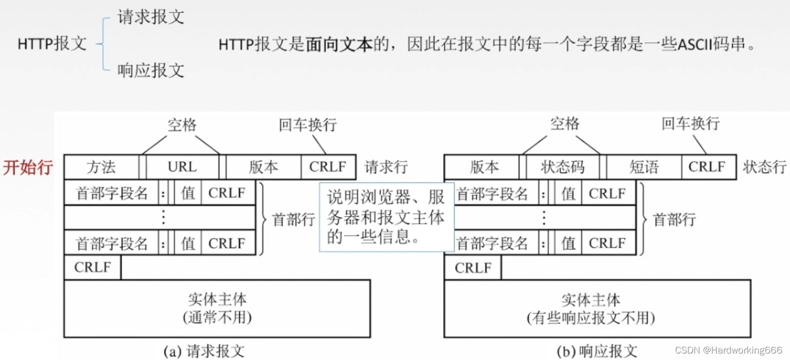
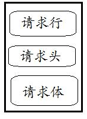
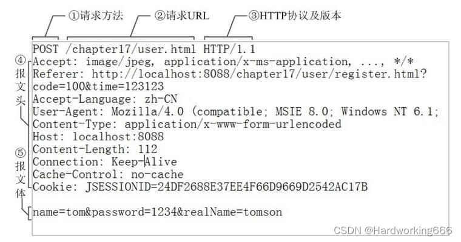
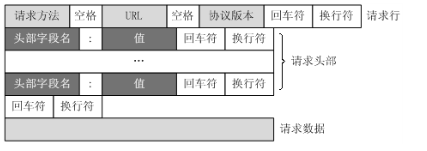
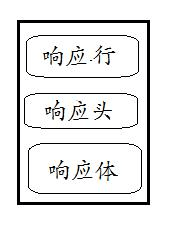
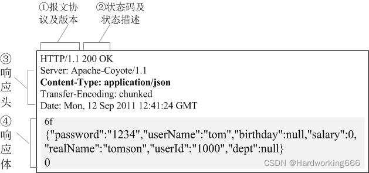

# HTTP 报文

## HTTP 请求报文

HTTP 请求报文由3部分组成（请求行+请求头+请求体）：

下面是一个实际的请求报文 ：

① 是请求方法，GET 和 POST 是最常见的 HTTP 方法，除此以外还包括 DELETE、HEAD、OPTIONS、PUT、TRACE。不过，当前的大多数浏览器只支持 GET 和 POST，Spring 3.0 提供了一个 HiddenHttpMethodFilter ，允许你通过“_method”的表单参数指定这些特殊的 HTTP 方法（实际上还是通过 POST 提交表单）。服务端配置了 HiddenHttpMethodFilter 后，Spring 会根据 _method 参数指定的值模拟出相应的 HTTP 方法，这样，就可以使用这些 HTTP 方法对处理方法进行映射了。

② 为请求对应的 URL 地址，它和报文头的 Host 属性组成完整的请求 URL，

③ 是协议名称及版本号。

④ 是 HTTP 的报文头，报文头包含若干个属性，格式为“属性名:属性值”，服务端据此获取客户端的信息。

⑤ 是报文体，它将一个页面表单中的组件值通过 param1=value1¶m2=value2 的键值对形式编码成一个格式化串，它承载多个请求参数的数据。不但报文体可以传递请求参数，请求 URL 也可以通过类似于“/chapter15/user.html? param1=value1¶m2=value2”的方式传递请求参数。

对照上面的请求报文，我们把它进一步分解，你可以看到一幅更详细的结构图：

## HTTP 响应报文

HTTP 的响应报文也由三部分组成（响应行+响应头+响应体）：

以下是一个实际的 HTTP 响应报文：

① 报文协议及版本；

② 状态码及状态描述；

③ 响应报文头，也是由多个属性组成；

④ 响应报文体，即我们真正要的“干货”。

以下是几个常见的状态码 :

  - 100 Continue 信息型状态响应码表示目前为止一切正常，客户端应该继续请求，如果已完成请求则忽略。

  - 101 Switching Protocol（协议切换）状态码表示服务器应客户端升级协议的请求（Upgrade (en-US)请求头）正在切换协议。

  - 200 OK 处理成功！

  - 303 See Other 我把你 redirect 到其它的页面，目标的 URL 通过响应报文头的 Location 告诉你。

  - 304 Not Modified 告诉客户端，你请求的这个资源至你上次取得后，并没有更改，你直接用你本地的缓存吧，我很忙哦，你能不能少来烦我啊！

  - 404 Not Found 你最不希望看到的，即找不到页面。如你在 google 上找到一个页面，点击这个链接返回 404，表示这个页面已经被网站删除了。

  - 500 Internal Server Error 看到这个错误，你就应该查查服务端的日志了，肯定抛出了一堆异常。

## 请求方法
  
根据 HTTP 标准，HTTP 请求可以使用多种请求方法。

HTTP1.0 定义了三种请求方法： GET, POST 和 HEAD 方法。

HTTP1.1 新增了六种请求方法：OPTIONS、PUT、PATCH、DELETE、TRACE 和 CONNECT 方法。

GET : 请求指定的页面信息，并返回实体主体。

HEAD : 类似于 GET 请求，只不过返回的响应中没有具体的内容，用于获取报头

POST : 向指定资源提交数据进行处理请求（例如提交表单或者上传文件）。数据被包含在请求体中。POST 请求可能会导致新的资源的建立和/或已有资源的修改。

PUT : 从客户端向服务器传送的数据取代指定的文档的内容。

DELETE : 请求服务器删除指定的页面。

CONNECT : HTTP/1.1 协议中预留给能够将连接改为管道方式的代理服务器。

OPTIONS : 允许客户端查看服务器的性能。

TRACE : 回显服务器收到的请求，主要用于测试或诊断。

PATCH : 是对 PUT 方法的补充，用来对已知资源进行局部更新 。