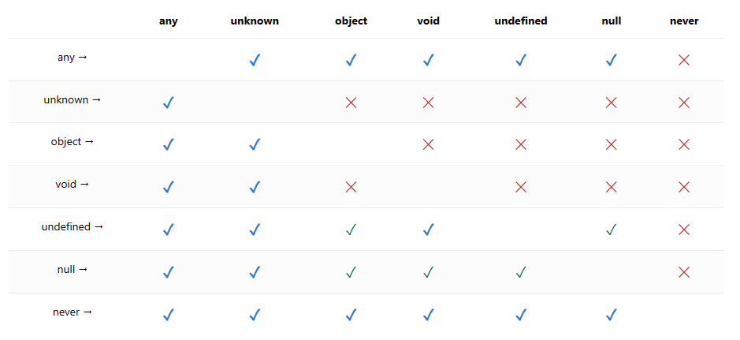

#### 类型推断

- 这种推断发生在初始化变量和成员，设置默认参数值和决定函数返回值时。
- TypeScript 类型推论也可能按照相反的方向进行。 这被叫做“按上下文归类”。按上下文归类会发生在表达式的类型与所处的位置相关时。
- 上下文归类会在很多情况下使用到。 通常包含函数的参数，赋值表达式的右边，类型断言，对象成员和数组字面量和返回值语句。 上下文类型也会做为最佳通用类型的候选类型。

#### 类型兼容性

- TypeScript 里的类型兼容性是基于结构子类型的。 结构类型是一种只使用其成员来描述类型的方式。
- TypeScript 结构化类型系统的基本规则是，如果 x 要兼容 y（意思是 y 能赋值给 x 使用），那么 y 至少具有与 x 相同的属性。

#### 函数的类型兼容性

类型系统强制源函数的返回值类型必须是目标函数（被赋值一方）返回值类型的子类型。

#### 函数参数双向协变

- 指的是参数类型
  当比较函数参数类型时，只有当源函数参数能够赋值给目标函数或者反过来时才能赋值成功。 这是不稳定的，因为调用者可能传入了一个具有更精确类型信息的函数，但是调用这个传入的函数的时候却使用了不是那么精确的类型信息。 实际上，这极少会发生错误，并且能够实现很多 JavaScript 里的常见模式。

#### 可选参数及剩余参数

比较函数兼容性的时候，可选参数与必须参数是可互换的（注意这句话，当可选参数虽然是可选的，但一旦用到必须参数的方法上就是必须参数了，所以他俩是可互换的）。 源类型上有额外的可选参数不是错误，目标类型的可选参数在源类型里没有对应的参数也不是错误。

当一个函数有剩余参数时，它被当做无限个可选参数。（这里需要注意）

这对于类型系统来说是不稳定的，但从运行时的角度来看，可选参数一般来说是不强制的，因为对于大多数函数来说相当于传递了一些 undefinded。

#### 枚举

枚举类型与数字类型兼容，并且数字类型与枚举类型兼容。不同枚举类型之间是不兼容的。
枚举可以赋值给字符串类型，但是字符串类型不能赋值给枚举类型（经测试得出的结论）

#### 类

类与对象字面量和接口差不多，但有一点不同：类有静态部分和实例部分的类型。 比较两个类类型的对象时，只有实例的成员会被比较。 静态成员和构造函数不在比较的范围内
类的私有成员和受保护成员会影响兼容性。 当检查类实例的兼容时，如果目标类型包含一个私有成员，那么源类型必须包含来自同一个类的这个私有成员。 同样地，这条规则也适用于包含受保护成员实例的类型检查。 这允许子类赋值给父类，但是不能赋值给其它有同样类型的类

#### 泛型

因为 TypeScript 是结构性的类型系统，类型参数只影响使用其做为类型一部分的结果类型。所以比较时会把泛型参数带入后在比较，非常智能，并不是说泛型参数不一样类型就不一样了。
对于没指定泛型类型的泛型参数时，会把所有泛型参数当成 any 比较。 然后用结果类型进行比较。

## 高级主题

#### 子类型与赋值

目前为止，我们使用了“兼容性”，它在语言规范里没有定义。 在 TypeScript 里，有两种兼容性：子类型和赋值。 它们的不同点在于，赋值扩展了子类型兼容性，增加了一些规则，允许和 any 来回赋值（这里确实不同，如果是以子类型来判断兼容性的话 any 就不能赋值给它的子类型了），以及 enum 和对应数字值之间的来回赋值（注意这里是来回赋值，就是双向赋值）。

语言里的不同地方分别使用了它们之中的机制。 实际上，类型兼容性是由赋值兼容性来控制的，即使在 implements 和 extends 语句也不例外。

关于什么是子类型的定义，如果 a 能赋值给 b，b 不能赋值给 a 的话那么 a 就是 b 的子类型。

具体的赋值表如下

#### 赋值兼容性与子类型兼容性

- 在进行赋值、函数调用时传递参数，TypeScript 会对变量进行类型兼容性检查，若类型兼容性检查通过，则说明满足赋值兼容性要求。

- 一般情况下，若满足子类型兼容性，则一定满足赋值兼容性；然而，满足赋值兼容性，并不一定满足子类型兼容性。(这里针对的是一些特殊类型，比如any，详见上图赋值表)

#### 子类型兼容性

- 据面向对象程序设计中[[里氏替换原则]]描述，程序中任何使用了超（父）类型的地方都可以使用其子类型进行替换。TypeScript 中的子类型兼容性体现的就是这一原则，而这也正是多态。

- 多态在类型论中指的是：相同的消息在发送给不同对象时，系统可以根据对象类型不同，分别引发对应类型的方法。

#### 属性成员类型

- 若对象类型 S 是对象类型 T 的子类型，则对于 T 中的每一个属性成员 M，都能够在 S 中找到一个同名的属性 N，满足 N 是 M 的子类型。也就是说 S 必须包含 T 中的所有属性成员，T 的属性成员个数不能多于 S 的。该关系也可以简单记为：协变。

- 另外，对象类型 T 中的必选属性成员在 S 中也必须是必选属性成员。

- 这里 S 包含 T 中所有属性成员，满足子类型兼容性

#### 联合类型

联合类型由若干成员类型构成，检查联合类型时需要考虑各个成员类型的子类型关系。(联合类型就相当于是个数组，进行检查时都是一个一个来的)

检查规则为：若 S 的所有成员类型都是类型 T 的子类型，则 S 是 T 的子类型，也是[[联合类型]]中交集的概念。

#### 交叉类型

交叉类型由若干成员类型构成，检查交叉类型时需要考虑各个成员类型的子类型关系。检查规则为：若 S 至少有一个成员类型是类型 T 的子类型，则 S 是 T 的子类型，也是[[交叉类型]]中并集的概念。